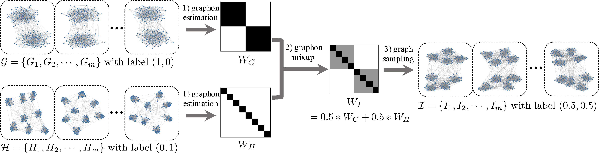

# $\mathcal{G}$-Mixup: Graph Data Augmentation for Graph Classification

Implementaion of ICML2022 paper $\mathcal{G}$-Mixup: Graph Data Augmentation for Graph Classification [[arxiv]](https://arxiv.org/abs/2202.07179).

## 1. Introduction

This work develops mixup for graph data. Mixup has shown superiority in improving the generalization and robustness of neural networks by interpolating features and labels between two random samples. Traditionally, Mixup can work on regular, grid-like, and Euclidean data such as image or tabular data. However, it is challenging to directly adopt Mixup to augment graph data because different graphs typically: 1) have different numbers of nodes; 2) are not readily aligned; and 3) have unique typologies in non-Euclidean space. To this end, we propose $\mathcal{G}$-Mixup to augment graphs for graph classification by interpolating the generator (i.e., graphon) of different classes of graphs. Specifically, we first use graphs within the same class to estimate a graphon. Then, instead of directly manipulating graphs, we interpolate graphons of different classes in the Euclidean space to get mixed graphons, where the synthetic graphs are generated through sampling based on the mixed graphons. Extensive experiments show that $\mathcal{G}$-Mixup substantially improves the generalization and robustness of GNNs.




## 2. Run

1. Requirements

```txt
pytorch==1.7.1
cudatoolkit==11.0
torch==1.7.1
torch_geometric==1.6.3
opencv-python==4.5.3.56
scikit-image==0.18.3
```

2. to install torch-geometric==1.6.3

```txt
pip install torch_spline_conv-1.2.0-cp37-cp37m-linux_x86_64.whl
pip install torch_scatter-2.0.5-cp37-cp37m-linux_x86_64.whl
pip install torch_sparse-0.6.8-cp37-cp37m-linux_x86_64.whl
pip install torch_cluster-1.5.8-cp37-cp37m-linux_x86_64.whl
pip install torch-geometric==1.6.3
```


3. Data

We use the dataset built in torch_geometric. The dataset will be downloaded automatically.


4. Run Experiments
```txt
   run the run_vinilla.sh for vanilla GIN.
   run the run_gmixup.sh for g-mixup.
```


## 3. Open Question

Why is the standard deviation of graph classification so large? It is shown that the standard deviation of the graph classification task is significant. However, the reason for it still remains unclear, which may be related to the size of the GNN or the quality of the datasets. We have also observed this phenomenon, and other papers [1][2] have reported a similar phenomenon as well. So, it is still a challenging problem that has not yet been solved.


[1] Xu, Keyulu, et al. "How Powerful are Graph Neural Networks?." International Conference on Learning Representations. 2019.
[2] Bianchi, Filippo Maria, et al. "Spectral clustering with graph neural networks for graph pooling." International conference on machine learning. PMLR, 2020.


## 4. Cite Our Paper

If you use this code in your research, please cite our paper.

```
@article{han2022g,
  title={G-Mixup: Graph Data Augmentation for Graph Classification},
  author={Han, Xiaotian and Jiang, Zhimeng and Liu, Ninghao and Hu, Xia},
  journal={arXiv preprint arXiv:2202.07179},
  year={2022}
}
